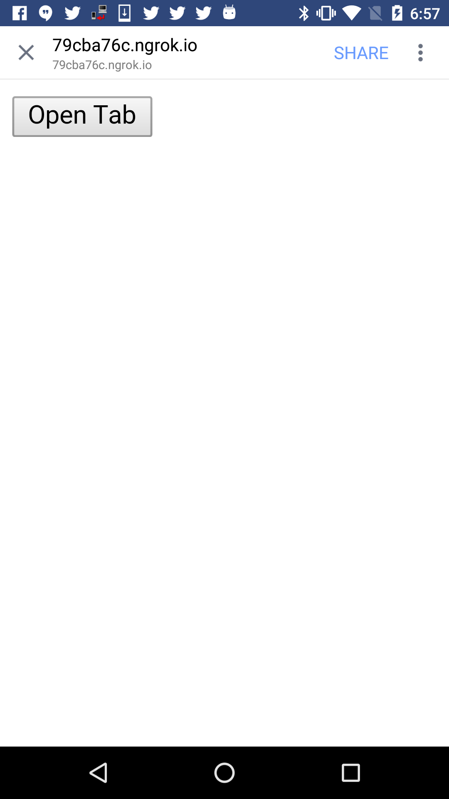

The latest Facebook app for android will white-out pages when `window.open`
is called.  No tab is opened, and the page is still left running and invisible.

To try, start a local server like this:

```
$ python -m SimpleHTTPServer 8000
$ ngrok http 8000
```

Then post a private message on your facebook wall containing your ngrok link
to try the page and reproduce the issue.  The page will white-out and you
will see an alert containing the html of the invisible page:

button | alert
---|---
 | 
